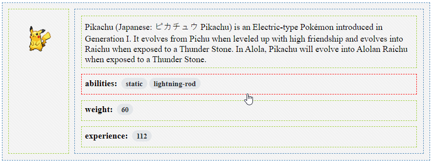
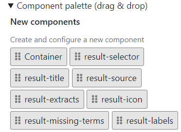

[](https://github.com/sinequa/ngx-ui-builder/actions/workflows/main.yml)

# UI Builder

_A library for making no-code Angular applications._

**UI Builder** is an Angular library that lets you transform an application with a static layout and fixed configuration into an application that can be easily reshaped and reconfigured by an end-user, without writing code.

## Principle

A normal Angular application has HTML templates that look like this:

```html
<div *ngFor="let product of products">
    <h3>{{product.name}}</h3>
    
    <p>{{product.description}}</p>
    <div>
        <span>EUR {{product.price}}</span>
        <button (click)="buy(product)">Add to basket</button>
    </div>
</div>
```

This template is fine, but it is static. If you need to change the layout, or change the price currency from "EUR" to "USD", then you need a developer to modify the app and rebuild it.

**What if the developer could transform the app into a set of modular building blocks, and let the users do what they want, with the simplicity of drag & drop and configuration forms?**

With UI Builder, this can be achieved with the following steps:

1. Replace the above template with a "zone", including the sub-templates that users will drag & drop and configure.
2. Define your default layout with configuration.
3. Insert a configurator, with optional configurators for each sub-template

### 1) Create a zone

A zone is defined like this:

```html
<uib-zone id="products" [data]="products">

    <!-- Product name -->
    <ng-template uib-template="name" let-data="data">
        <h3>{{data.name}}</h3>
    </ng-template>

    <!-- Product description -->
    <ng-template uib-template="description" let-data="data">
        <p>{{data.description}}</p>
    </ng-template>
    
    <!-- Product image -->
    <ng-template uib-template="image" let-data="data">
        
    </ng-template>
    
    <!-- Product price -->
    <ng-template uib-template="price" let-data="data" let-config>
        <span>{{config.currency}} {{product.price}}</span>
        <button (click)="buy(product)">Add to basket</button>
    </ng-template>
    
</uib-zone>
```

We pass a list of templates to the zone by transclusion. These templates are just regular Angular templates. They may include one or multiple Angular components, or just plain HTML. Notice that these templates have 2 inputs: `data` and `config`. `data` corresponds to _variable_ data (such as the product price displayed in this example). `config` corresponds to any other parameter that does not depend on the data (like the price currency).

### 2) Define a default layout

The zone defined above will display components according to a given configuration. This configuration should be initialized when the application starts.

In order to display one of the templates defined above, the configuration must include:
- A configuration object for that template
- A "container" that references that template

Every "zone" should have a "container" configuration corresponding to the "root" of these HTML elements:

```
zone "products"
|_ container "products"
  |_ template "name"
  |_ template "description"
  |_ template "image"
  |_ template "price"
```

Note that this structure can be hierachical, as containers can include other containers.

This arborescence of configuration is defined like this:

```ts
import {Component, OnInit} from '@angular/core';
import {ConfigService} from 'ngx-ui-builder';

export class MyComponent implements OnInit {

    constructor(
        public configService: ConfigService
    ){}

    ngOnInit() {
        this.configService.init([{
            id: 'products',
            type: '_container',
            items: ['name', 'description', 'image', 'price']
        },{
            id: 'price',
            type: 'price',
            currency: 'EUR'
        }]);
    }
}
```

Notice that:
- Each configuration object is passed to the template, hence why it is possible to use the parameters with bindings like this: `<span>{{config.currency}}</span>`
- It is possible to omit a trivial configuration object, if it does not have any configuration, like the "name", "description" and "image" templates. The library automatically creates a `{id: 'name', type: 'name'}` object
- There is no obligation to have an equal `id` and `type`. In fact, the same template can be displayed multiple times, with different input configurations. The only constraint is that `id` must be unique, and `type` must refer to a template name (see [Step 1](#1-create-a-zone))

At this point, the application is functional: the zone should display the templates, according to the configuration tree.

### 3) Insert a configurator

The configurator is a component from the UI Builder library which is displayed when the user clicks on a component to configure it. It can display several built-in forms as well as (optional) custom forms corresponding to each of your templates.

Like for the zones, the custom configurators are passed by transclusion.

```html
<uib-configurator>
    
    <ng-template uib-template="price" let-context>
        <!-- Currency selector -->
        <label for="currency">Currency</label>
        <select [(ngModel)]="context.config.currency" id="currency" (ngModelChange)="context.configChanged()">
            <option value="EUR">Euro</option>
            <option value="USD">Dollar</option>
        </select>
    </ng-template>
    
    <ng-template uib-template="_container">
        <!-- Standard palette of components for containers -->
        <uib-palette [context]="context.context" [configurators]="context.configurators"></uib-palette>
    </ng-template>

</uib-configurator>
```

## Features

### State management

Configuration is at the heart of the UI Builder: It defines which components are displayed, their visual layout and which parameters they use.

Configuration is managed in a reactive store based on [Elf](https://ngneat.github.io/elf/) (itself based on [RxJS](https://rxjs.dev/)). Elf includes a state history which powers **Undo**/**Redo** buttons. Therefore, every action on the configuration (moving a component with drag & drop, creating a new component, or modifying its parameters) is undoable.

Any change to the configuration is immediately visible in the UI, giving users a "what you see is what you get experience" (Wysiwyg).

Configuration can be easily synced with a server so that users always retrieve the application in the state they left it.

### Hierarchical containers

A container is a built-in type of component that displays sub-components (whose ids are listed in the `items` property):

```js
{
    id: 'products',
    type: '_container',
    items: ['name', 'description', 'image', 'price']
}
```

Containers can contain other containers, which can contain other containers, and so on. This allows to create abritrarily complex layouts, with rows nested into columns, nested into rows, etc.



### Configuration tree

The configuration tree can be used to visualize the configuration of each components. It represents the hierarchy of components within containers, within containers (etc.), within each zone.

It also allows to see the location of a component and select it directly, rather than having to look for it in the UI.


### Drag & drop

Components can be dragged and dropped intuitively within their zone. A component can be moved within its container, or within a different container.

Drag & drop can also be used to drag new components in from a palette, or for removing a component from its zone.

Drag & Drop is powered by the [ngx-drag-drop](https://reppners.github.io/ngx-drag-drop/) library.

### Component palettes

Palettes of components are generated automatically based on the templates available to a zone. If a zone has 3 templates, then the palette will let you drag & drop any of those 3 templates anywhere into the zone, multiple times if needed.

Additionally, the palette lets users drag & drop new containers into existing containers.

When a template has a custom configurator, this configurator is displayed in a modal prior to insertion, so that the user can initialize its configuration properly.



### Form templates

Components can have completely custom templates. These templates are passed by transclusion to the `uib-configurator` component, and are displayed when the user selects the component with a click, directly in the UI, or from the configuration tree.

Simply pass a configurator template with the same name as the component template (in this case, "foo"):

```html
<uib-zone id="my-zone">
    <!-- Component template -->
    <ng-template uib-template="foo" let-config>
        <h1>Hello world</h1>
        <p *ngIf="config.showText">Lorem Ipsum...</p>
    </ng-template>
</uib-zone>

...

<uib-configurator>
    <!-- Configurator template -->
    <ng-template uib-template="foo" let-context>
        <input type="checkbox" id="text" [(ngModel)]="!!context.config.showText" (ngModelChange)="context.configChanged()">
        <label for="text">Show text</label>
    </ng-template>
</uib-configurator>
```

### Custom layouts

Containers use [CSS flexbox](https://developer.mozilla.org/en-US/docs/Web/CSS/CSS_Flexible_Box_Layout) to display inner elements with a wide range of options (direction, alignment, wrapping, etc.)

Containers have a built-in configurator for configuring these flexbox property visually.


### Conditional components

### Style encapsulation
